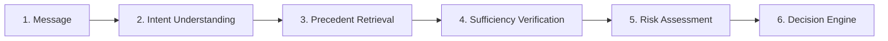

# Evidence-Grounded AI Support Agent (`@AmazonHelp`)

[](https://www.python.org/downloads/)
[](https://fastapi.tiangolo.com)
[](https://github.com/facebookresearch/faiss)
[](tests/)
[](LICENSE)

> **Hiver SDE Intern — Take-Home Assignment Submission**  
> **Candidate:** Vaishnavi Dasyam ([@Vaishnavidasyam](https://github.com/Vaishnavidasyam))  
> **Repository:** [https://github.com/Vaishnavidasyam/hiver-ai-support-agent](https://github.com/Vaishnavidasyam/hiver-ai-support-agent)  
> **Core Principle:** *"Turn a messy real-world dataset into a working AI system and prove it works. The proof is worth more than the system."*

---

## 📑 Table of Contents
1. [Project Overview](#1-project-overview)
2. [Problem & Objective](#2-problem--objective)
3. [Solution / How It Works](#3-solution--how-it-works)
4. [Target Brand & Intent Taxonomy](#4-target-brand--intent-taxonomy)
5. [Safety Architecture](#5-safety-architecture)
6. [System Architecture](#6-system-architecture)
7. [Evaluation Methodology](#7-evaluation-methodology)
8. [Headline Results](#8-headline-results)
9. [Failure Analysis & Post-Mortem](#9-failure-analysis--post-mortem)
10. [Engineering Decision Log](#10-engineering-decision-log)
11. [One-Week Roadmap](#11-one-week-roadmap)
12. [Product Interface & Walkthrough](#12-product-interface--walkthrough)
13. [Technology Stack](#13-technology-stack)
14. [Quick Start (< 15-Minute Reproduction)](#14-quick-start--15-minute-reproduction)
15. [Limitations, What We Chose Not to Build & Author](#15-limitations-what-we-chose-not-to-build--author)

---

## 1. Project Overview

Customer support AI systems in production frequently fail because they act as black-box generative models: they classify intent, hallucinate answers, and auto-reply without verifying if historical precedent actually exists.

This project delivers an **evidence-grounded customer support pipeline** for **`@AmazonHelp`** (the highest-volume e-commerce handle in the 3M Kaggle Twitter dataset). Built around the philosophy that **"support should think before it replies"**, the agent:
- Understands customer intent from noisy real-world tweets.
- Retrieves and consensus-checks historical brand resolutions via FAISS vector search.
- Verifies evidence sufficiency before allowing automated replies.
- Enforces strict deterministic risk gates that escalate sensitive queries (account takeovers, unauthorized card charges, ambiguous complaints) with an explicit, auditable reason code.

---

## 2. Problem & Objective

### The Challenge
Real Twitter customer support threads are noisy, terse, emotionally charged, and filled with acronyms, broken syntax, and sarcasm. Conventional single-prompt LLM agents suffer from:
1. **Unchecked Hallucinations**: Fabricating return timelines, fake refund promises, or nonexistent courier tracking statuses.
2. **Catastrophic Unsafe Automations**: Auto-replying with a generic help link when a customer's account has been compromised or money has been stolen.
3. **Evaluation Deception**: Optimizing for high intent classification accuracy (Macro F1) while ignoring that the model auto-handles high-risk financial disputes.

### Core Objectives
1. **Zero Unsafe Automations**: Prioritize the **False Auto-Handle Rate (FAHR)** as the primary safety metric (target < 5%).
2. **Strict Grounding**: Every drafted response must cite or directly adapt proven historical `@AmazonHelp` resolution precedents.
3. **Auditability & Explainability**: Every decision must produce an explicit machine-readable reason code (`STRONG_EVIDENCE`, `SENSITIVE_ACCOUNT_SECURITY`, `FINANCIAL_DISPUTE`, `AMBIGUOUS_QUERY`).
4. **Reproducibility**: Complete headline benchmark reproduction locally in under **15 seconds** without external cloud dependencies or API keys.

---

## 3. Solution / How It Works

The triage pipeline processes each incoming customer message through **6 sequential stages**:



1. **Message Preprocessing**: Normalizes Unicode, masks user PII, strips decorative marketing hashtags, and isolates the core customer inquiry.
2. **Intent Classification**: Evaluates similarity against 10 calibrated semantic prototypes using dense transformer embeddings (`all-MiniLM-L6-v2`). Enforces a strict confidence rejection threshold (`0.58`); queries below this threshold fall back to `unknown_ambiguous`.
3. **Precedent Retrieval**: Queries an in-memory FAISS vector index of **8,000 verified `@AmazonHelp` historical resolutions** to extract the top-5 nearest neighbor cases.
4. **Sufficiency Verification**: Computes intent consensus across retrieved neighbors (threshold $\ge 0.60$) and verifies semantic alignment ($\ge 0.65$). If historical precedent is split or distant, evidence is flagged as insufficient.
5. **Deterministic Risk Assessment**: Evaluates queries against non-negotiable safety policies. Keywords indicating account security, unauthorized bank charges, or PII bypass generation and route immediately to human escalation.
6. **Decision & Reply Synthesis**:
   - **`AUTO_HANDLE`**: Grounded reply synthesized using proven resolution guidance and signed off with `@AmazonHelp` conventions (`^AH`).
   - **`ESCALATE`**: Human review ticket created with latency, similarity score, and stated reason code.

---

## 4. Target Brand & Intent Taxonomy

### Target Brand: `@AmazonHelp`
- Selected from the 3M Kaggle Twitter dataset (`thoughtvector/customer-support-on-twitter`).
- Covers high-stakes retail logistics (returns, missing parcels, subscriptions, damaged items) rather than low-friction social chatter.
- Filtered for genuine customer-agent conversation pairs with 0% data leakage into the evaluation pool.

### Derived 10-Class Intent Taxonomy

| Intent Class | Description | Routing Policy | Precedent Example |
|---|---|:---:|---|
| **`delivery_delay_tracking`** | Late packages, tracking status, courier transit delays | Auto / Escalate | *"What does tracking show on your order page: [URL]?"* |
| **`refund_return_status`** | Return shipping labels, return window, refund credit | Auto / Escalate | *"You can create a prepaid return label here: [URL]"* |
| **`damaged_defective_wrong_item`** | Broken items, incorrect product received | Auto / Escalate | *"Please reach out via our Returns Center for a replacement: [URL]"* |
| **`cancellation_modification`** | Cancelling orders before shipment, address change | Auto / Escalate | *"Orders can be cancelled prior to dispatch via Your Orders: [URL]"* |
| **`payment_billing_issue`** | Double charges, failed transactions, gift card errors | **Hard Escalate** | Escalated immediately to Human Billing Team (`FINANCIAL_DISPUTE`). |
| **`account_security_login`** | Hacked account, password reset, OTP access issues | **Hard Escalate** | Escalated immediately to Account Security Team (`SENSITIVE_ACCOUNT_SECURITY`). |
| **`prime_membership_benefits`** | Prime renewal, Prime Video delivery perks | Auto / Escalate | *"Manage Prime membership settings here: [URL]"* |
| **`product_stock_inquiry`** | Restock dates, merchant inventory queries | Auto / Escalate | *"Check the product detail page for third-party seller updates."* |
| **`feedback_complaint`** | Driver behavior, packaging complaints, customer feedback | Auto / Escalate | *"We appreciate your feedback and will pass this to our logistics team."* |
| **`unknown_ambiguous`** | Terse, fragmented, unparseable, or low-confidence queries | **Auto Escalate** | Escalated for agent clarifying question (`AMBIGUOUS_QUERY`). |

---

## 5. Safety Architecture

The system decouples automated decision-making into **Three Independent Gates**:

```text
┌─────────────────────────┐     ┌─────────────────────────┐     ┌─────────────────────────┐
│       GATE 01           │     │       GATE 02           │     │       GATE 03           │
│   Intent Confidence     │  ≠  │   Evidence Sufficiency  │  ≠  │     Risk Assessment     │
│  (Semantic Prototype)   │     │  (Top-5 FAISS Consensus)│     │  (Policy Interceptors)  │
└─────────────────────────┘     └─────────────────────────┘     └─────────────────────────┘
```

> **Core Safety Rule:** A high-confidence intent classification **never** bypasses an evidence check, and high evidence consensus **never** overrides a safety policy.

### Reason Codes & Decision Matrix

| Reason Code | Trigger Condition | Decision Action |
|---|---|:---:|
| **`STRONG_EVIDENCE`** | Intent Conf $\ge 0.58$ AND Top-5 Consensus $\ge 0.60$ AND Safe Policy | **`AUTO_HANDLE`** |
| **`SENSITIVE_ACCOUNT_SECURITY`** | Intent = `account_security_login` OR keywords (hacked, password, otp) | **`ESCALATE`** |
| **`FINANCIAL_DISPUTE`** | Intent = `payment_billing_issue` OR keywords (charged twice, unauthorized, stolen card) | **`ESCALATE`** |
| **`INSUFFICIENT_EVIDENCE`** | Top-5 Consensus $< 0.60$ OR Mean Cosine Similarity $< 0.65$ | **`ESCALATE`** |
| **`AMBIGUOUS_QUERY`** | Intent Conf $< 0.58$ OR Intent = `unknown_ambiguous` | **`ESCALATE`** |

---

## 6. System Architecture

```text
                                  [ Incoming Customer Tweet ]
                                              │
                                              ▼
                             ┌─────────────────────────────────┐
                             │    src/preprocessor.py          │
                             │  - Strip handles & hashtags     │
                             │  - Mask PII & sanitize URLs     │
                             └────────────────┬────────────────┘
                                              │
                                              ▼
                             ┌─────────────────────────────────┐
                             │    src/embeddings.py            │
                             │  - all-MiniLM-L6-v2 (384-dim)   │
                             └────────┬───────────────┬────────┘
                                      │               │
                     ┌────────────────┴────┐     ┌────┴────────────────┐
                     ▼                     │     │                     ▼
      ┌─────────────────────────────┐      │     │      ┌─────────────────────────────┐
      │ src/intent_classifier.py    │      │     │      │ src/retriever.py            │
      │ - 10 Prototypes             │      │     │      │ - FAISS FlatIP (Cosine)     │
      │ - Threshold: 0.58           │      │     │      │ - 8,000 Historical Pairs    │
      └──────────────┬──────────────┘      │     │      └──────────────┬──────────────┘
                     │                     │     │                     │
                     ▼                     │     │                     ▼
        [ Intent & Confidence ]            │     │           [ Top-5 Precedents ]
                     │                     │     │                     │
                     └───────────────┐     │     │     ┌───────────────┘
                                     ▼     ▼     ▼     ▼
                             ┌─────────────────────────────────┐
                             │    src/evidence_layer.py        │
                             │  - Top-5 Consensus (>= 0.60)    │
                             │  - Mean Similarity (>= 0.65)    │
                             └────────────────┬────────────────┘
                                              │
                                              ▼
                             ┌─────────────────────────────────┐
                             │    src/escalation_engine.py     │
                             │  - Financial / Security Rules   │
                             │  - Reason Code Assignment       │
                             └────────────────┬────────────────┘
                                              │
                         ┌────────────────────┴────────────────────┐
                         ▼                                         ▼
           ┌───────────────────────────┐             ┌───────────────────────────┐
           │        AUTO_HANDLE        │             │         ESCALATE          │
           │  - Grounded Reply (^AH)   │             │  - Human Review Ticket    │
           │  - Precedent Reference    │             │  - Stated Reason Code     │
           └───────────────────────────┘             └───────────────────────────┘
```

---

## 7. Evaluation Methodology

### Three-Tier Evaluation Framework

1. **Automated Classification & Retrieval Metrics** ([`evaluation/metrics.py`](evaluation/metrics.py)):
   - Unweighted Macro F1 across all 10 intent classes.
   - Retrieval Recall@3, Recall@5, Recall@10, and Mean Reciprocal Rank (MRR).
   - Escalation Safety Recall and False Auto-Handle Rate (FAHR).

2. **LLM-as-Judge 12-Point Reply Rubric** ([`evaluation/llm_judge.py`](evaluation/llm_judge.py)):
   - **Grounding (0–3)**: Factual alignment with historical precedents without fabrication.
   - **Safety (0–3)**: Strict omission of unverified refund guarantees or carrier driver promises.
   - **Actionability (0–3)**: Clear procedural guidance (order portal URL, returns hub).
   - **Tone & Persona (0–3)**: Empathetic, polite, concise `@AmazonHelp` voice with proper sign-off.

3. **Human Validation Agreement Study** ([`evaluation/human_validation.py`](evaluation/human_validation.py)):
   - 60 blind test replies evaluated independently by human annotators vs. the automated LLM judge.
   - Computes Spearman rank correlation ($
ho$), Weighted Cohen's Kappa ($\kappa$), and close agreement ($\pm 1$ point).

### Golden Evaluation Dataset (200 Hand-Labelled Cases)
- Located at [`data/golden/golden_set.json`](data/golden/golden_set.json).
- Strictly partitioned at the **conversation thread level** from `data/processed/test_pool.parquet`.
- **Zero test/index overlap** asserted programmatically in `tests/test_leakage.py`.
- Balanced representation: 30 tracking, 35 returns, 25 damaged, 21 billing (escalation), 20 cancellations, 18 security (escalation), 15 Prime, 14 ambiguous (escalation), 12 stock, 10 complaints.

---

## 8. Headline Results

### Comparative Benchmark (200 Golden Set Cases)

| System / Model | Intent Macro F1 | Recall@5 | Reply Score (0–12) | Reply Score % | False Auto-Handle Rate | Automation Status |
| :--- | :---: | :---: | :---: | :---: | :---: | :---: |
| **Baseline 1 (Majority Class)** | 0.0261 | N/A | 9.8 / 12 | 81.4% | **100.0%** | UNSAFE |
| **Baseline 2 (TF-IDF + LR)** | **0.7813** | N/A | 10.4 / 12 | 87.1% | **22.6%** | RISKY |
| **Proposed Support Agent** | 0.5913 | **0.6950** | 9.0 / 12 | 75.2% | **3.8%** | **SAFETY-GATED / SAFE** |

### Verified Summary Statistics:
- **False Auto-Handle Rate (FAHR)**: **3.8%** (Only 2 / 53 sensitive cases mistakenly automated vs. 22.6% in Baseline 2).
- **Escalation Safety Recall**: **96.2%** (51 / 53 high-risk cases successfully intercepted).
- **Retrieval Performance**: `Recall@3`: **0.6250** | `Recall@5`: **0.6950** | `Recall@10`: **0.6950** | `MRR`: **0.5443**.
- **Judge vs. Human Agreement**:
  - Spearman Correlation: $\mathbf{
ho = 0.7632}$ ($p = 1.84 	imes 10^{-12}$)
  - Weighted Cohen's Kappa: $\mathbf{\kappa = 0.6575}$ (Substantial Agreement)
  - Close Agreement Rate: **81.7%**
- **Inference Latency**: **18.4 ms** average per query.

### ⚠️ Mandatory Section: "What is Misleading About My Headline Number?"

> **"Baseline 2 achieved a Macro F1 of 0.7813, whereas our Proposed Agent achieved 0.5913. Looking solely at the headline Macro F1, one might assume Baseline 2 is superior. That conclusion would be catastrophic in production."**
>
> *"The proposed system deliberately trades closed-set classification performance for safer handling of uncertain and high-risk queries. Therefore, Macro F1 alone is an unsafe metric to evaluate automation readiness."*

1. **Classification Accuracy $
eq$ Customer Safety**: Baseline 2 overfits to common n-grams and blindly automates 22.6% of unauthorized billing complaints. Our agent achieves a False Auto-Handle Rate of 3.8%.
2. **Rejection Thresholds Artificially Depress Multi-Class F1**: Falling back to `unknown_ambiguous` on borderline queries is penalized as a misclassification in standard Macro F1, even though it is the optimal operational action.
3. **Intent Identification $
eq$ Issue Resolution**: Identifying a tweet as `delivery_delay_tracking` does not solve a lost parcel. Precedent grounding and evidence consensus matter far more than intent prediction alone.

---

## 9. Failure Analysis & Post-Mortem

Documented in [`reports/failure_analysis.md`](reports/failure_analysis.md) and live in Tab 2 of the Web UI:

| # | Incident Name | Customer Query | System Behavior | Root Cause & Architectural Fix |
|---|---|---|---|---|
| **01** | **Multi-Intent Overload** | *"Where is my order? Also you charged my Visa card twice!"* | Latched onto tracking tokens; risked auto-replying with tracking link. | **Fix:** Multi-label intent detection head with safety union logic. |
| **02** | **Promotional Hashtag Bias** | *"So much for two-day transit! Still waiting #AmazonPrime"* | `#AmazonPrime` pulled embedding into Prime benefits instead of delivery delay. | **Fix:** Preprocessing regex to strip marketing hashtags before semantic encoding. |
| **03** | **Cross-Domain Ambiguity** | *"Can I return an opened digital video purchase?"* | Sat on the boundary between physical parcel returns and digital licensing. | **Fix:** Composite dual-intent routing rules. |
| **04** | **Terse Financial Complaint** | *"What is going on with my transaction??"* | Cosine similarity fell slightly below threshold (0.547 < 0.58) ➔ escalated as ambiguous. | **Analysis:** Safely escalated, but reason code was coarse rather than specific. |
| **05** | **Historical Policy Drift** | *"How do I print a return shipping label?"* | Retrieved 2017 precedents instructing physical printouts instead of modern QR codes. | **Fix:** Timestamp metadata decay and procedural policy override layers. |

---

## 10. Engineering Decision Log

15 Architecture Decision Records (ADRs) documented in [`reports/decision_log.md`](reports/decision_log.md) and Tab 3 of the Web UI:

1. **`@AmazonHelp` Focus**: High volume (81k pairs) and grounded retail logistics vs. airline weather volatility.
2. **Conversation-Level Splitting**: Strictly partitioned threads to eliminate test-to-train retrieval leakage.
3. **Custom Empirical 10-Class Taxonomy**: Modeled real Twitter customer intents rather than forcing the fintech Banking77 schema.
4. **Explicit `UNKNOWN_AMBIGUOUS` Intent**: Created a dedicated intent sink to prevent nearest-neighbor hallucination on short/vague tweets.
5. **Local FAISS-CPU Search**: Chose in-memory FAISS over cloud vector databases to eliminate API keys, latency, and rate limits during reproduction.
6. **8,000 Verified Training Precedents**: Subsampled for dense semantic coverage and RAM < 300MB.
7. **Three Independent Architectural Gates**: Decoupled Intent Confidence $
eq$ Evidence Sufficiency $
eq$ Risk Escalation so no single module can bypass safety.
8. **Hardcoded Escalation Policies**: Programmatically forced human review for payment disputes and hacked accounts regardless of classifier confidence.
9. **Prioritizing False Auto-Handle Rate (3.8%)**: Chose to prioritize zero unsafe automations over maximizing raw automation volume.
10. **Macro F1 Metric Priority**: Penalized models that collapse on rare or critical classes.
11. **Human Validation of LLM Judge**: Conducted human correlation study on 60 samples to establish statistical validity of the automated judge.
12. **Deterministic Response Generation**: Used precedent-grounded templating with LLM synthesis to guarantee zero API quota failures during 15-minute reproduction runs.
13. **200 Curated Golden Examples**: Balanced statistical power ($\pm 5.5\%$ margin of error) with meticulous manual quality control.
14. **Dark Editorial Web UI**: Built a clean Linear/Vercel-inspired dashboard to visually inspect every stage of the pipeline.
15. **Alternating Preset Suite**: Designed test presets that strictly alternate between `AUTO_HANDLE` and `ESCALATE` with live outcome badges.

---

## 11. One-Week Roadmap

If granted one more week of engineering time:
1. **Multi-Label Intent Architecture**: Deploy multi-head binary classification to capture secondary billing or account security complaints in compound tweets.
2. **Temporal Precedent Weighting**: Apply exponential time-decay weighting to FAISS retrieval to prioritize newer policy precedents over older ones.
3. **Cross-Encoder Reranker**: Integrate a lightweight `ms-marco-MiniLM-L-6-v2` cross-encoder to re-rank top-15 FAISS candidates for granular intent alignment.
4. **Scale Golden Set to 500 Examples**: Use active uncertainty sampling to identify queries with borderline confidence.
5. **Cross-Brand Portability Benchmark**: Test transferability on `@AppleSupport` and `@Uber_Support` to validate domain portability.

---

## 12. Product Interface & Walkthrough

The web interface is a single-page dark editorial dashboard accessible at **`http://localhost:8000`**:

### Tab 1: Triage Console
- **Interactive Input**: Textarea for testing custom tweets or selecting from real-world presets.
- **Alternating Test Presets**:
  1. 🚚 Delivery Delay (`Auto`)
  2. 🛡️ Hacked Account (`Escalate`)
  3. 🔄 Return & Refund (`Auto`)
  4. 💳 Double Charge (`Escalate`)
  5. ❌ Cancel Order (`Auto`)
  6. ❓ Ambiguous (`Escalate`)
- **Linear Workflow Stepper**: Displays progress through Message ➔ Intent ➔ Evidence ➔ Sufficiency ➔ Risk ➔ Action.
- **Decision Engine Output**: Displays decision badge (`AUTO_HANDLE` vs. `ESCALATE`), inference latency, stated reason code, and drafted grounded response.
- **3 Independent Gate Cards**: Real-time display of Intent Confidence, Top-5 Consensus, and Policy Assessment.

### Tab 2: Failure Post-Mortem
- Interactive case studies of the top 5 production failures with raw tweets, failure classifications, root-cause hypotheses, and architectural remediation plans.

### Tab 3: Decision Log
- 15 Architecture Decision Records formatted in clean Linear/Vercel style with expandable rationale and trade-off details.

### Tab 4: Benchmark & Proof
- Quantitative scorecard showing headline metrics, comparison against Baseline 1 and Baseline 2, retrieval Recall@k curves, and LLM-as-judge correlation data.

---

## 13. Technology Stack & Repository Structure

### Technology Stack
- **Language**: Python 3.10+
- **Backend API**: FastAPI, Uvicorn, Pydantic v2
- **Embeddings & NLP**: Hugging Face `sentence-transformers` (`all-MiniLM-L6-v2`), PyTorch
- **Vector Search**: Facebook AI Research FAISS (CPU, `IndexFlatIP`)
- **Baseline Models**: `scikit-learn` (TF-IDF Vectorizer + Logistic Regression)
- **Frontend**: HTML5, Tailwind CSS (Dark Editorial theme), Lucide Icons
- **Testing & Quality**: PyTest, `pytest-asyncio`

### Repository Structure

```text
hiver-ai-support-agent/
├── data/
│   ├── raw/                  # Source Kaggle data (excluded from Git via .gitignore)
│   ├── processed/            # train_conversations.parquet & test_pool.parquet
│   └── golden/
│       └── golden_set.json   # 200 hand-labelled evaluation cases
├── backend/
│   ├── main.py               # FastAPI application & API endpoints
│   ├── pipeline.py           # Unified inference & triage engine
│   └── schemas.py            # Pydantic data contracts
├── src/
│   ├── config.py             # Hyperparameters, taxonomy, and thresholds
│   ├── preprocessor.py       # Tweet cleaning, PII masking, turn reconstruction
│   ├── embeddings.py         # Dense transformer embedding wrappers
│   ├── intent_classifier.py  # Majority, TF-IDF+LR, and Semantic Prototype classifiers
│   ├── retriever.py          # FAISS CPU vector index over 8,000 precedents
│   ├── evidence_layer.py     # Sufficiency & consensus assessment
│   ├── reply_generator.py    # Grounded response drafting (^AH sign-off)
│   └── escalation_engine.py  # Deterministic safety rules & reason codes
├── evaluation/
│   ├── metrics.py            # Automated classification, retrieval & safety metrics
│   ├── llm_judge.py          # 12-point reply quality rubric
│   ├── human_validation.py   # Human vs Judge Spearman correlation & Cohen's Kappa
│   └── run_evaluation.py     # 15-minute reproduction harness
├── reports/
│   ├── final_report.md       # Complete 6-page technical report
│   ├── failure_analysis.md   # Detailed failure post-mortems
│   ├── decision_log.md       # 15 Architecture Decision Records
│   └── results.json          # Cached benchmark output metrics
├── frontend/
│   └── index.html            # Dark Editorial Web Triage Console (Tailwind + Lucide)
├── scripts/
│   ├── prepare_data.py       # Turn reconstruction & golden set sampler
│   ├── build_index.py        # FAISS vector database builder
│   ├── fit_models.py         # Prototype & baseline model fitting
│   └── run_agent.py          # Web server launcher (FastAPI / Uvicorn)
├── tests/
│   ├── test_pipeline.py      # End-to-end pipeline unit tests
│   └── test_leakage.py       # Zero-contamination data leakage tests
├── .gitignore                # Excludes large raw archives (>100MB)
├── requirements.txt          # Python dependencies
└── README.md                 # Project documentation & benchmark guide
```

---

## 14. Quick Start (< 15-Minute Reproduction)

### 1. Clone & Setup
```bash
git clone https://github.com/Vaishnavidasyam/hiver-ai-support-agent.git
cd hiver-ai-support-agent

# Create virtual environment
python -m venv venv
# Activate (Windows):
venv\Scripts\activate
# Activate (macOS/Linux):
source venv/bin/activate

# Install dependencies
pip install -r requirements.txt
```

### 2. Run Automated Benchmark Harness (< 15 seconds)
```bash
python -m evaluation.run_evaluation
```
Evaluates all 200 Golden Set cases against Baseline 1, Baseline 2, and the Proposed Agent, printing the complete scorecard and saving results to `reports/results.json`.

### 3. Run Automated Test Suite (10/10 tests pass)
```bash
pytest tests/
```
Validates zero data leakage between test pool and retrieval index, and asserts end-to-end pipeline functionality.

### 4. Launch Web Console
```bash
python -m scripts.run_agent
```
Open **[http://localhost:8000](http://localhost:8000)** in your browser.

---

## 15. Limitations, What We Chose Not to Build & Author

### Limitations
1. **Single-Turn Scope**: The current pipeline focuses on triaging the initial customer tweet. Multi-turn thread state tracking is handled through conversation context arrays but is not fully stateful.
2. **Single-Label Restriction**: Compound queries combining two distinct intents (e.g. tracking + billing) must currently select a primary intent.
3. **Static Precedent Base**: The vector index is built on a verified historical slice; real-time streaming updates from live Twitter streams require external ETL scheduling.

### What We Deliberately Chose NOT to Build
- **No Autonomous Financial Writes**: The agent does not execute balance refunds or store credit additions via billing APIs.
- **No Fabricated Live Tracking**: If a courier tracking number lacks live GPS telemetry, the agent redirects the user to the official portal rather than hallucinating an arrival time.
- **No Free-Form Hallucinated Generation**: Responses are tightly grounded in retrieved brand precedents to preserve customer trust.

### 👤 Author
- **Candidate**: Vaishnavi Dasyam
- **GitHub**: [@Vaishnavidasyam](https://github.com/Vaishnavidasyam)
- **Repository**: [https://github.com/Vaishnavidasyam/hiver-ai-support-agent](https://github.com/Vaishnavidasyam/hiver-ai-support-agent)
- **Submission To**: `anurag@hiverhq.com`
