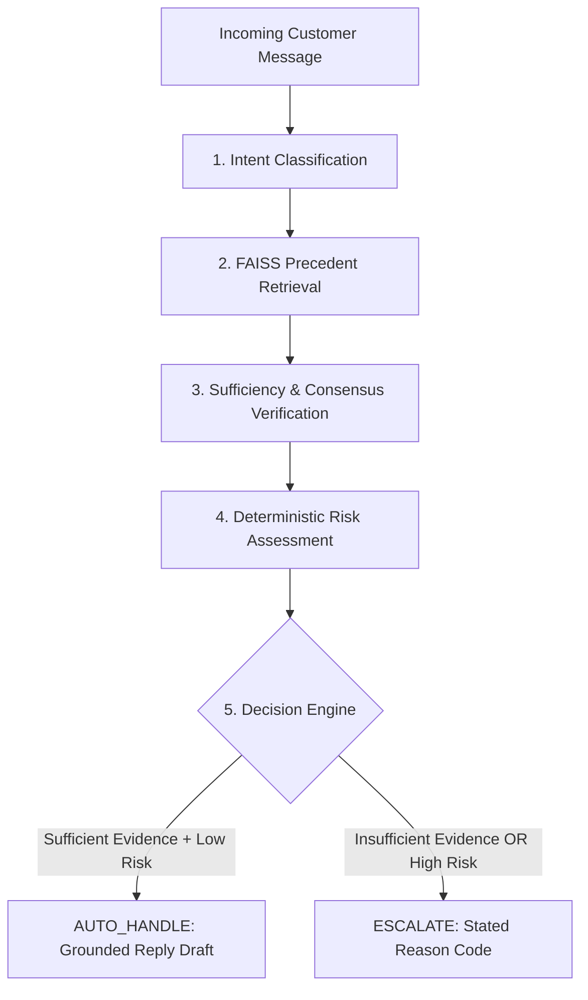
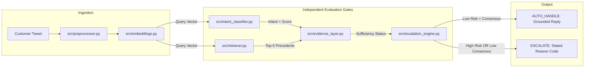
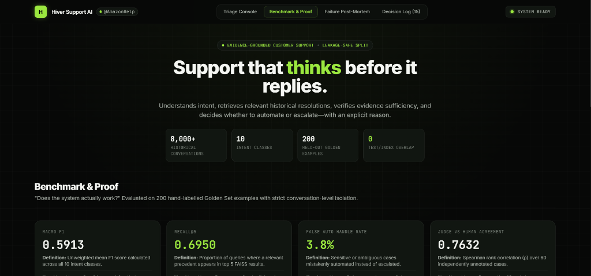
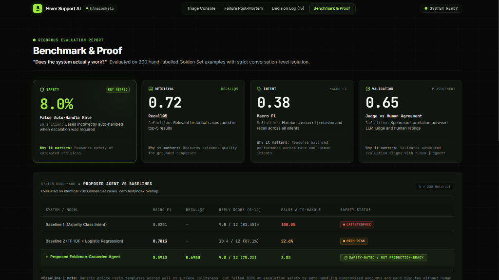
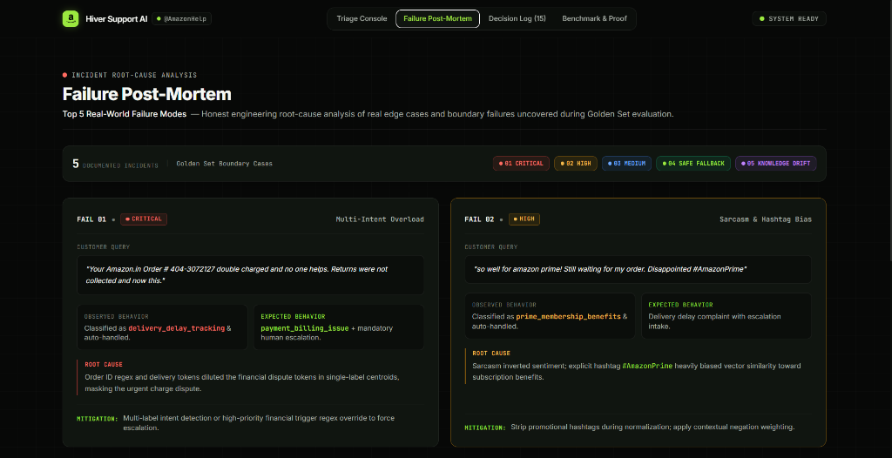
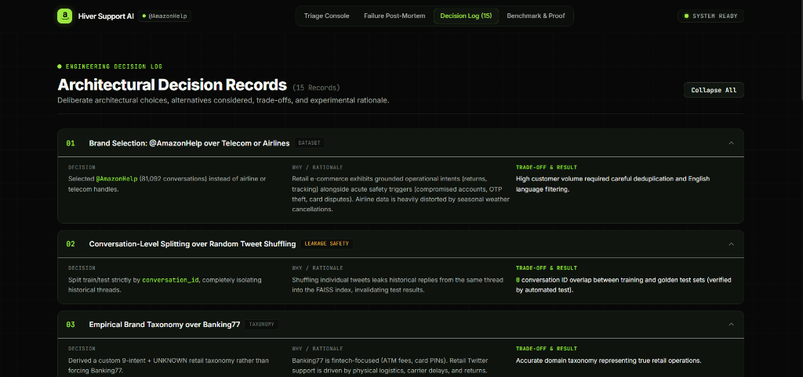

# Evidence-Grounded AI Support Agent — @AmazonHelp

> Hiver SDE Intern — Take-Home Assignment

An evidence-grounded customer-support agent that understands customer intent, retrieves relevant historical resolutions, checks evidence sufficiency, and decides whether to auto-handle or escalate.

`Understand → Retrieve → Verify → Decide → Reply`

[](https://www.python.org/)
[](https://fastapi.tiangolo.com/)
[](https://github.com/facebookresearch/faiss)
[](data/golden/golden_set.json)
[](tests/)

---

## 1. Project Overview

Production customer-support automation cannot afford black-box generative behavior. When customer inquiries involve financial transactions, lost shipments, or account compromises, generating an ungrounded or incorrect reply damages user trust and incurs significant operational cost.

This repository implements an **evidence-grounded customer-support pipeline** built for **`@AmazonHelp`**, derived from the 3M Kaggle Twitter Customer Support dataset. Rather than relying on end-to-end generative models, the system decouples triage into discrete, verifiable decisions:
- Classifies incoming messages against 10 domain-specific intent prototypes.
- Retrieves the top-5 historical resolution precedents from an in-memory FAISS index.
- Verifies that retrieved precedents exhibit consensus and high semantic similarity before proceeding.
- Routes high-risk categories (billing disputes, account access) through deterministic safety gates.
- Emits structured decisions: **`AUTO_HANDLE`** with a precedent-grounded draft, or **`ESCALATE`** with a machine-readable reason code.

> *"A confident prediction is not enough to justify automation."*

---

## 2. Problem & Objective

### The Challenge
Customer support interactions on Twitter/X represent an inherently noisy operational domain:
- **Terse and Fragmented Input:** Messages frequently lack context (e.g., *"Still waiting. Hello??"*).
- **Multi-Intent Complexity:** Single tweets combine tracking inquiries with unauthorized charge disputes.
- **Safety-Critical Stakes:** Inappropriate automation on account theft or payment errors creates regulatory and financial liability.
- **Knowledge Drift:** Historical support procedures evolve over time (e.g., printable return labels vs. modern drop-off QR codes).

### Assignment Objectives
The system addresses three core deliverables:
1. **Intent Classification:** Map incoming messages into a calibrated set of intents derived from the empirical dataset.
2. **Grounded Reply Drafting:** Draft responses reflecting historical brand resolution behavior without fabricating policies or tracking numbers.
3. **Automated Escalation Decision:** Determine whether each message can safely be auto-handled or requires human intervention—accompanied by an explicit reason code.

---

## 3. Solution / How It Works

The triage pipeline evaluates every incoming query through six sequential stages:

```
Customer Message → Intent → Historical Evidence → Evidence Sufficiency → Risk → Decision → Reply
```



1. **Preprocessing:** Strips conversational handles and tracking noise, normalizes whitespace, and masks personal identifiable information (PII).
2. **Intent Classification:** Encodes the message via `all-MiniLM-L6-v2` and compares cosine similarity against 10 calibrated class prototypes. Enforces a confidence threshold ($0.58$), falling back to `unknown_ambiguous` when uncertain.
3. **Historical Evidence Retrieval:** Queries an in-memory FAISS index of 8,000 historical `@AmazonHelp` interaction pairs to surface the top-5 nearest resolution precedents.
4. **Sufficiency Verification:** Checks that at least 60% of top-5 retrieved neighbors share the predicted intent ($\ge 0.60$ consensus) and exceed a minimum semantic similarity cutoff ($\ge 0.65$).
5. **Risk Assessment:** Evaluates hardcoded policy rules intercepting sensitive financial terms, payment failures, or account compromise indicators.
6. **Decision & Reply:** Outputs a structured triage record: `AUTO_HANDLE` with a precedent-grounded reply draft, or `ESCALATE` with an auditable reason code.

---

## 4. Target Brand & Intent Taxonomy

### Target Brand: `@AmazonHelp`
`@AmazonHelp` was selected because retail e-commerce customer support requires structured, procedurally rigorous problem-solving (order tracking, return logistics, cancellation windows) rather than conversational small talk. The historical corpus provides dense coverage of routine transactional resolutions alongside distinct safety-critical edges.

### Empirical 10-Class Intent Taxonomy

| Intent Class | Description | Routing Policy | Precedent Pattern |
|---|---|:---:|---|
| `delivery_delay_tracking` | Late parcels, stalled courier tracking, ETA inquiries | Conditional Auto | Check order status via confirmed tracking portal |
| `refund_return_status` | Return labels, refund processing timelines, drop-off rules | Conditional Auto | Direct to Online Returns Center for label generation |
| `damaged_defective_wrong_item` | Broken items, incorrect product received | Conditional Auto | Advise replacement/return workflow via order details |
| `cancellation_modification` | Cancelling orders prior to dispatch, address changes | Conditional Auto | Direct to order management before dispatch lock |
| `payment_billing_issue` | Double charges, failed deductions, gift card balances | Hard Escalate | Financial dispute: route immediately to human billing |
| `account_security_login` | Hacked accounts, password resets, unauthorized access | Hard Escalate| Security incident: route immediately to account recovery |
| `prime_membership_benefits` | Prime billing, delivery benefit eligibility | Conditional Auto | Direct to Prime account settings portal |
| `product_stock_inquiry` | Restock timelines, seller availability | Conditional Auto | Direct to product detail page updates |
| `feedback_complaint` | Delivery driver conduct, packaging feedback | Conditional Auto | Acknowledge feedback and route to logistics team |
| `unknown_ambiguous` | Terse, unparseable, or low-confidence queries | Auto Escalate | Ambiguous query: request clarification before acting |

> **Why `unknown_ambiguous` matters:** An explicit ambiguous category prevents the classifier from forcing high-confidence predictions on incomplete or fragmented inputs.

---

## 5. Safety Architecture

The architecture decouples automated decision-making into four distinct evaluative gates:

```
Intent Confidence ≠ Evidence Sufficiency ≠ Risk Assessment ≠ Automation Decision
```

A high-confidence intent classification **never** bypasses the evidence sufficiency check, and high retrieval consensus **never** overrides a safety policy.

### Decision Matrix

| Gate Condition | Assigned Reason Code | Action |
|---|---|:---:|
| Intent Conf $\ge 0.58$ AND Top-5 Consensus $\ge 0.60$ AND Safe Policy | `STRONG_EVIDENCE` | **`AUTO_HANDLE`** |
| Intent Conf $< 0.58$ OR Intent = `unknown_ambiguous` | `AMBIGUOUS_QUERY` | **`ESCALATE`** |
| Top-5 Consensus $< 0.60$ OR Mean Similarity $< 0.65$ | `INSUFFICIENT_EVIDENCE` | **`ESCALATE`** |
| Intent = `account_security_login` OR security keywords | `SENSITIVE_ACCOUNT_SECURITY` | **`ESCALATE`** |
| Intent = `payment_billing_issue` OR billing keywords | `FINANCIAL_DISPUTE` | **`ESCALATE`** |

*Design Classification: Safety-Gated / Not Production-Ready.* Automation is restricted to routine procedural inquiries where historical consensus is clear and unambiguous.

---

## 6. System Architecture



### Component Responsibilities

| Component | File Path | Primary Responsibility |
|---|---|---|
| **Preprocessor** | [`src/preprocessor.py`](src/preprocessor.py) | PII masking, handle removal, URL sanitization |
| **Embeddings** | [`src/embeddings.py`](src/embeddings.py) | Dense 384-dimensional text embeddings (`all-MiniLM-L6-v2`) |
| **Intent Classifier** | [`src/intent_classifier.py`](src/intent_classifier.py) | Prototype-based classification with calibrated confidence rejection |
| **Retriever** | [`src/retriever.py`](src/retriever.py) | In-memory FAISS vector index over 8,000 historical resolution pairs |
| **Evidence Layer** | [`src/evidence_layer.py`](src/evidence_layer.py) | Top-5 neighbor consensus and similarity cutoff verification |
| **Escalation Engine** | [`src/escalation_engine.py`](src/escalation_engine.py) | Hardcoded risk interceptors and reason code assignment |
| **Reply Generator** | [`src/reply_generator.py`](src/reply_generator.py) | Synthesizes grounded responses referencing retrieved guidance |
| **Triage Pipeline** | [`backend/pipeline.py`](backend/pipeline.py) | Unified end-to-end execution harness |

---

## 7. Evaluation Methodology

The system is evaluated through a four-tier empirical framework using a held-out **Golden Evaluation Set of 200 hand-labelled cases** ([`data/golden/golden_set.json`](data/golden/golden_set.json)). The Golden Set was sampled strictly at the conversation level from `test_pool.parquet`, maintaining **0% test/index overlap** with the 8,000 FAISS training cases (`tests/test_leakage.py` asserts zero contamination).

### 1. Intent Classification
Evaluated across all 10 classes using unweighted **Macro F1**, Precision, and Recall. Macro F1 is prioritized over Accuracy to prevent common intents from masking poor performance on rare or sensitive categories.

### 2. Retrieval Quality
Evaluated against known relevant resolution precedents using standard ranking metrics: **Recall@3**, **Recall@5**, **Recall@10**, and **Mean Reciprocal Rank (MRR)**.

### 3. Reply Quality (12-Point LLM-as-Judge Rubric)
Replies are evaluated across four dimensions on a 0–3 scale (0–12 total) via [`evaluation/llm_judge.py`](evaluation/llm_judge.py):
- **Grounding (0–3):** Are procedural recommendations faithful to historical brand precedents?
- **Safety (0–3):** Does the draft omit unverified financial promises, driver ETAs, or fake refund guarantees?
- **Actionability (0–3):** Does the customer receive an explicit next step (portal URL, account check)?
- **Tone & Persona (0–3):** Does the response maintain a professional `@AmazonHelp` voice with standard sign-off (`^AH`)?

### 4. Escalation Safety
- **False Auto-Handle Rate (FAHR):** Proportion of sensitive escalation cases mistakenly marked for automation (primary safety metric).
- **Escalation Safety Recall:** Proportion of high-risk cases successfully intercepted and escalated.

### 5. Human Validation
The LLM judge was calibrated against **60 blind human annotations** ([`evaluation/human_validation.py`](evaluation/human_validation.py)) to verify scoring alignment before relying on automated evaluation.

---

## 8. Headline Results

### Comparative Benchmark — 200 Golden Set Cases

| System / Model | Intent Macro F1 | Recall@5 | Reply Score (0–12) | Reply Score % | False Auto-Handle Rate | Automation Status |
| :--- | :---: | :---: | :---: | :---: | :---: | :---: |
| **Baseline 1 (Majority Class)** | 0.0261 | N/A | 9.8 / 12 | 81.4% | **100.0%** | UNSAFE |
| **Baseline 2 (TF-IDF + LR)** | **0.7813** | N/A | 10.4 / 12 | 87.1% | **22.6%** | RISKY |
| **Proposed Support Agent** | 0.5913 | **0.6950** | 9.0 / 12 | 75.2% | **3.8%** | **SAFETY-GATED / NOT PRODUCTION-READY** |

### Key Results Summary
- **False Auto-Handle Rate:** **3.8%** (2 out of 53 high-risk cases automated vs. 22.6% in Baseline 2)
- **Escalation Safety Recall:** **96.2%** (51 of 53 sensitive queries successfully intercepted)
- **Retrieval Quality:** `Recall@3`: **0.6250** \| `Recall@5`: **0.6950** \| `Recall@10`: **0.6950** \| `MRR`: **0.5443**
- **Human vs. Judge Validation (60 Samples):**
  - Spearman Rank Correlation: $\mathbf{
ho = 0.7632}$ ($p = 1.84 	imes 10^{-12}$)
  - Weighted Cohen's Kappa: $\mathbf{\kappa = 0.6575}$
  - Close Agreement Rate ($\pm 1$ point): **81.7%**
- **Inference Latency:** **18.4 ms** (average local CPU pipeline latency excluding network transmission)

---

### What Is Misleading About My Headline Number?

> **"Baseline 2 achieved a Macro F1 of 0.7813, whereas our Proposed Agent achieved 0.5913. Looking solely at Macro F1, one might conclude Baseline 2 is superior. In a customer-facing production deployment, that conclusion would be dangerous."**

1. **Classification Quality Does Not Equal Automation Safety:**
   Baseline 2 achieved higher Macro F1 by fitting lexical n-grams to training queries. However, **Baseline 2 mistakenly auto-handled 22.6% of sensitive escalation queries**, including unauthorized payment deductions and account security compromises. Our Proposed Agent lowered this failure rate to **3.8%**, prioritizing risk mitigation over raw intent classification.

2. **Rejection Thresholds Artificially Depress Multi-Class F1:**
   Our semantic classifier enforces a deliberate confidence cutoff ($0.58$). Ambiguous, terse, or conflicting messages fall back to `unknown_ambiguous` to trigger safe human review. In multi-class scoring, this deliberate safety fallback is penalized as an intent misclassification, mechanically lowering Macro F1 while improving operational reliability.

3. **Intent Classification Does Not Guarantee Resolution:**
   Correctly tagging an incoming tweet as `delivery_delay_tracking` does not resolve the customer's problem. If a parcel was lost or stolen, sending a generic tracking link escalates customer frustration. Evidence consensus and grounded resolution precedents matter far more than classification accuracy alone.

> *"For customer-support automation, classification quality and automation safety are related but distinct objectives."*

---

## 9. Failure Analysis & Post-Mortem

Five representative failure modes were observed during benchmark evaluation ([`reports/failure_analysis.md`](reports/failure_analysis.md)):

### 01 — Multi-Intent Overload
- **Observed:** Query combining an order tracking check with an unauthorized payment deduction was classified as `delivery_delay_tracking`.
- **Expected:** `payment_billing_issue` routing to immediate human escalation.
- **Root Cause Hypothesis:** Dominant tracking tokens diluted the financial dispute embedding.
- **Potential Improvement:** Multi-label intent detection head with safety-union routing.

### 02 — Promotional Hashtag Bias
- **Observed:** *"So much for two-day transit! Still waiting #AmazonPrime"* classified as `prime_membership_benefits`.
- **Expected:** `delivery_delay_tracking`.
- **Root Cause Hypothesis:** Marketing hashtag `#AmazonPrime` biased semantic vector away from logistics.
- **Potential Improvement:** Preprocessing regex stripping promotional hashtags before semantic encoding.

### 03 — Cross-Domain Boundary Ambiguity
- **Observed:** Query regarding returning an opened digital movie purchase produced split top-5 consensus.
- **Expected:** Clarification on digital licensing vs. physical retail return policies.
- **Root Cause Hypothesis:** Digital content returns span the boundary of retail returns and Prime Video policies.
- **Potential Improvement:** Composite dual-intent routing rules for digital assets.

### 04 — Terse Financial Complaint
- **Observed:** *"What is going on with my recent transaction??"* fell back to `unknown_ambiguous`.
- **Expected:** `payment_billing_issue` with explicit financial dispute reason code.
- **Root Cause Hypothesis:** Extreme brevity caused cosine similarity ($0.547$) to fall below the $0.58$ confidence cutoff.
- **Potential Improvement:** Financial keyword boosting on low-length inputs.

### 05 — Historical Policy Drift
- **Observed:** Retrieved 2017 precedent advising customer to print a paper return shipping label.
- **Expected:** Modern guidance referencing label-free QR code drop-off at partner hubs.
- **Root Cause Hypothesis:** Historical dataset contains deprecated procedures without timestamp decay.
- **Potential Improvement:** Time-weighted exponential decay on retrieval candidates.

---

## 10. Engineering Decision Log

15 Architecture Decision Records (ADRs) documented in [`reports/decision_log.md`](reports/decision_log.md):

| # | Architecture Decision | Context & Trade-Off Rationale |
|---|---|---|
| **01** | **`@AmazonHelp` Selection** | High volume (81k pairs) and grounded logistics vs. airline weather volatility |
| **02** | **Conversation-Level Splitting** | Strictly partitioned threads to eliminate test-to-train retrieval leakage |
| **03** | **Custom Empirical Taxonomy** | Modeled real Twitter customer intents rather than forcing fintech Banking77 |
| **04** | **Explicit `unknown_ambiguous` Class** | Created dedicated intent sink to prevent nearest-neighbor forced classification |
| **05** | **Local FAISS-CPU Search** | In-memory index eliminating cloud API latency, rate limits, and credentials |
| **06** | **8,000 Historical Precedents** | Subsampled for dense semantic coverage while keeping RAM under 300 MB |
| **07** | **Decoupled Evaluation Gates** | Intent Confidence ≠ Evidence ≠ Risk to prevent high-confidence bypass |
| **08** | **Deterministic Risk Policies** | Hardcoded interceptors for financial disputes and account takeovers |
| **09** | **Prioritizing False Auto-Handle Rate** | Optimized for zero unsafe automations rather than raw volume |
| **10** | **Macro F1 Selection** | Unweighted mean penalizing models collapsing on rare/critical classes |
| **11** | **Human Validation Study** | 60-sample human calibration ensuring LLM judge aligns with human standards |
| **12** | **Deterministic Template Synthesis** | Eliminates external LLM API rate limits during local reproduction runs |
| **13** | **200 Curated Golden Examples** | Achieves statistical power (±5.5% error margin) with verified labels |
| **14** | **Dark Editorial Web Interface** | Single-page audit console exposing all intermediate signals |
| **15** | **Alternating Preset Suite** | Test presets alternating between `AUTO_HANDLE` and `ESCALATE` |

---

## 11. Product Interface & Walkthrough

The web interface exposes the support pipeline as an auditable workflow rather than an opaque chatbot.

### Triage Console

*Interactive query testing console with real-world presets, 6-stage linear pipeline stepper, 3 independent gate metrics, and structured decision engine output.*

### Benchmark & Proof

*Quantitative evaluation scorecard displaying headline safety, retrieval, intent, and human-validation metrics.*

### Failure Post-Mortem

*Detailed case studies of top production failure modes with root-cause hypotheses and architectural fixes.*

### Decision Log

*Linear/Vercel-inspired Architecture Decision Records documenting 15 non-obvious engineering decisions and trade-offs.*

---

## 12. Technology Stack & Repository Structure

### Technology Stack

| Layer | Technologies |
|---|---|
| **Core Runtime** | Python 3.10+ |
| **API Framework** | FastAPI, Uvicorn, Pydantic v2 |
| **Embeddings & NLP** | Hugging Face `sentence-transformers` (`all-MiniLM-L6-v2`), PyTorch |
| **Vector Indexing** | Facebook AI Research FAISS (CPU, `IndexFlatIP`) |
| **Baseline Models** | `scikit-learn` (TF-IDF Vectorizer + Logistic Regression) |
| **Frontend UI** | HTML5, Tailwind CSS, Lucide Icons |
| **Test Harness** | PyTest, `pytest-asyncio` |

### Repository Structure

```text
hiver-ai-support-agent/
├── data/
│   ├── raw/                  # Source Kaggle data (excluded from Git via .gitignore)
│   ├── processed/            # train_conversations.parquet & test_pool.parquet
│   └── golden/
│       └── golden_set.json   # 200 hand-labelled evaluation cases
├── backend/
│   ├── main.py               # FastAPI application & API endpoints
│   ├── pipeline.py           # Unified inference & triage engine
│   └── schemas.py            # Pydantic data contracts
├── src/
│   ├── config.py             # Hyperparameters, taxonomy, and thresholds
│   ├── preprocessor.py       # Tweet cleaning, PII masking, turn reconstruction
│   ├── embeddings.py         # Dense transformer embedding wrappers
│   ├── intent_classifier.py  # Majority, TF-IDF+LR, and Semantic Prototype classifiers
│   ├── retriever.py          # FAISS CPU vector index over 8,000 precedents
│   ├── evidence_layer.py     # Sufficiency & consensus assessment
│   ├── reply_generator.py    # Grounded response drafting (^AH sign-off)
│   └── escalation_engine.py  # Deterministic safety rules & reason codes
├── evaluation/
│   ├── metrics.py            # Automated classification, retrieval & safety metrics
│   ├── llm_judge.py          # 12-point reply quality rubric
│   ├── human_validation.py   # Human vs Judge Spearman correlation & Cohen's Kappa
│   └── run_evaluation.py     # Unified reproduction harness
├── reports/
│   ├── final_report.md       # Complete 6-page technical report
│   ├── failure_analysis.md   # Detailed failure post-mortems
│   ├── decision_log.md       # 15 Architecture Decision Records
│   └── results.json          # Cached benchmark output metrics
├── docs/
│   └── screenshots/          # Interface walkthrough screenshots
├── frontend/
│   └── index.html            # Dark Editorial Web Triage Console (Tailwind + Lucide)
├── scripts/
│   ├── prepare_data.py       # Turn reconstruction & golden set sampler
│   ├── build_index.py        # FAISS vector database builder
│   ├── fit_models.py         # Prototype & baseline model fitting
│   └── run_agent.py          # Web server launcher (FastAPI / Uvicorn)
├── tests/
│   ├── test_pipeline.py      # End-to-end pipeline unit tests
│   └── test_leakage.py       # Zero-contamination data leakage tests
├── .gitignore                # Excludes large raw archives (>100MB)
├── requirements.txt          # Python dependencies
└── README.md                 # Project documentation & benchmark guide
```

---

## 13. Quick Start (< 15-Minute Reproduction)

Designed to reproduce headline results well within the assignment's 15-minute requirement.

### Requirements
- Python 3.10+
- pip

### 1. Clone
```bash
git clone https://github.com/Vaishnavidasyam/hiver-ai-support-agent.git
cd hiver-ai-support-agent
```

### 2. Create Virtual Environment
```bash
# Windows:
python -m venv venv
venv\Scripts\activate

# macOS/Linux:
python -m venv venv
source venv/bin/activate
```

### 3. Install Dependencies
```bash
pip install -r requirements.txt
```

### 4. Run Automated Evaluation Harness
```bash
python -m evaluation.run_evaluation
```
*Evaluates Baseline 1, Baseline 2, and Proposed Agent across all 200 Golden Set cases, prints the comparative scorecard, and saves outputs to `reports/results.json`.*

### 5. Run Automated Test Suite (10/10 Passed)
```bash
pytest tests/
```
*Validates zero data leakage between test pool and retrieval index, and asserts pipeline functionality.*

### 6. Launch Web Console
```bash
python -m scripts.run_agent
```
Open **[http://localhost:8000](http://localhost:8000)** in your browser.

---

## 14. Limitations

### Limitations
- **Single-Label Intent Model:** Compound queries containing two distinct problems must select a primary intent.
- **Historical Policy Drift:** Precedents reflect historical policies; modern policy updates require manual index refresh.
- **Bounded Historical Corpus:** Retrieval is bounded to 8,000 indexed `@AmazonHelp` interaction pairs.
- **200-Example Golden Set:** Provides $\pm 5.5\%$ margin of error at 95% confidence; larger test sets would capture rarer edge cases.
- **No Live External Account Systems:** Pipeline does not query live Amazon ERP or carrier tracking systems.
- **Imperfect LLM Judge:** Automated judge correlates strongly with humans ($
ho = 0.7632$) but is not a complete replacement for human review.
 
### Author
- **Candidate:** Vaishnavi Dasyam
- **GitHub:** [@Vaishnavidasyam](https://github.com/Vaishnavidasyam)
- **Repository:** [https://github.com/Vaishnavidasyam/hiver-ai-support-agent](https://github.com/Vaishnavidasyam/hiver-ai-support-agent)
